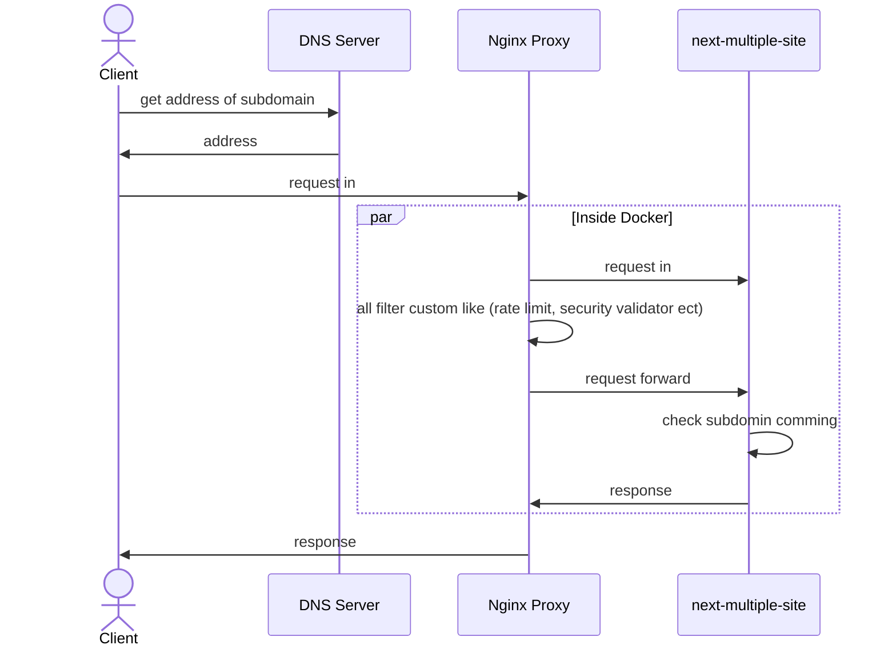

# Next.js Multiple Site (Subdomain) 🏋️‍♂️

## Development requirement 🏗
1. check  your local pc dns `/etc/host`
2. makesure subdomain has to asign to localhost
3. just run usually to install and run node.js package

## Production requirement 🚢

### 1. Using Docker 🐳
1. make sure the domain in .env.example has same with domain on mapping to the server
2. make sure subdomain is name with folder name in `pages` subfolder

### 2. In CPanel 🚤
on progress

## Apps Flow 

### 1. Using Docker 🐳

